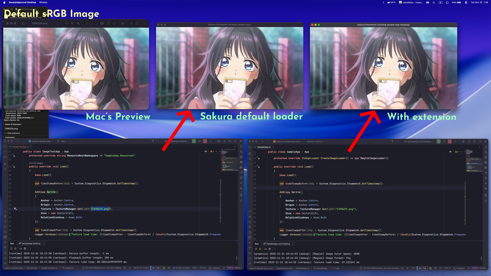
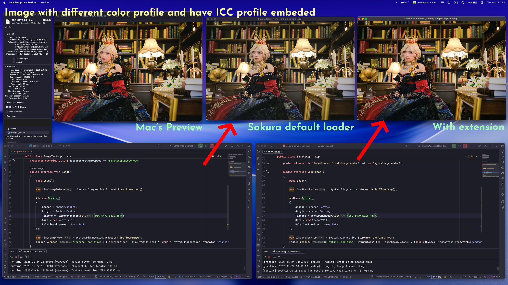

This repository is part of the [🌸🗡️ Sakura Framework](https://github.com/HelloYeew/sakura) ecosystem.

---

# Sakura Framework Imaging Extension

The extension library of [Sakura Framework](https://github.com/HelloYeew/sakura) for imaging related features.
This extension provides additional functionalities for an application that requires image processing capabilities such as photo editing software to manipulate images and ensure that the Sakura's renderer can render various image formats correctly.

## Why this extension?

The Sakura Framework already have the basic image loading and rendering capabilities. However we aim that the framework's core to be fast and lightweight.
The [default image loader] in the core framework can be render correctly on most picture. But some pictures that has the [ICC profile](https://en.wikipedia.org/wiki/ICC_profile) embeded in it may not be rendered correctly and make the color a bit "washed out" or "off" from the original picture since the default image loader only load the raw pixel data without considering the color profile.
This extension aims to support for developer who wants to build an application that requires the correct color representation from the image file and want more image processing features to use in their application.

_Will add more technical details here later..._

Since this extension aim for color correct and more feature on imaging. The image loading process may be a bit slower than the default image loader in the core framework on some case but it should not be a big difference on most image files.
So if your application does not require color correct image rendering or advanced image processing features, you can just use the default image loader in the core Sakura Framework.

## License

This extension is part of the Sakura Framework, see [the main repository](https://github.com/HelloYeew/sakura) for more information.

This project is licensed under the MIT license. Please see [the license file](LICENSE) for more information. tl;dr you can do whatever you want as long as you include the original copyright and license notice in any copy of the software/source.

This extension use [ImageMagick](https://imagemagick.org/) with [Magick.NET](https://github.com/dlemstra/Magick.NET). See [ImageMagick License](https://github.com/ImageMagick/ImageMagick/blob/main/LICENSE) and [Magick.NET License](https://github.com/dlemstra/Magick.NET/blob/main/License.txt) (Apache License 2.0) for more information.